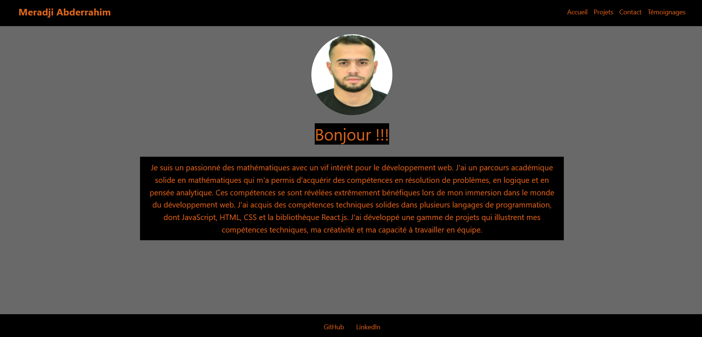

# Explication avec captures d'ecran:

## Page d'acceuil:



## Page de contact:


## Page de temoignages:


La page d'acceuil pour temoignage qui montre les liens vers les deux autres pages de la section de temoignages

## Page de temoignages:


page pour ajouter un temoignage, avec validation

## Page de temoignages:


On peut voir les temoignages ainsi que les modifiers ou supprimer, j'ai mis un temoignage constant que sera toujours afficher lors de demarrage de l'application

## Page de projet:


une page d'acceuil pour les projet qui montre les liens vers mes deux projets

## Page de projet1:


la page pour la description d'un projet, ainsi que les technologies utilises

This is a [Next.js](https://nextjs.org/) project bootstrapped with [`create-next-app`](https://github.com/vercel/next.js/tree/canary/packages/create-next-app).

## Getting Started

First, run the development server:

```bash
npm run dev
# or
yarn dev
# or
pnpm dev
```

Open [http://localhost:3000](http://localhost:3000) with your browser to see the result.

You can start editing the page by modifying `app/page.js`. The page auto-updates as you edit the file.

This project uses [`next/font`](https://nextjs.org/docs/basic-features/font-optimization) to automatically optimize and load Inter, a custom Google Font.

## Learn More

To learn more about Next.js, take a look at the following resources:

- [Next.js Documentation](https://nextjs.org/docs) - learn about Next.js features and API.
- [Learn Next.js](https://nextjs.org/learn) - an interactive Next.js tutorial.

You can check out [the Next.js GitHub repository](https://github.com/vercel/next.js/) - your feedback and contributions are welcome!
